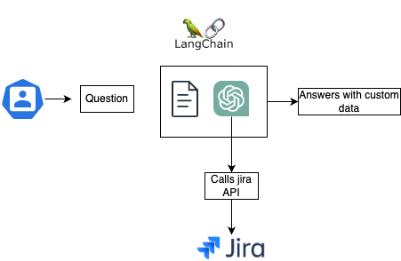
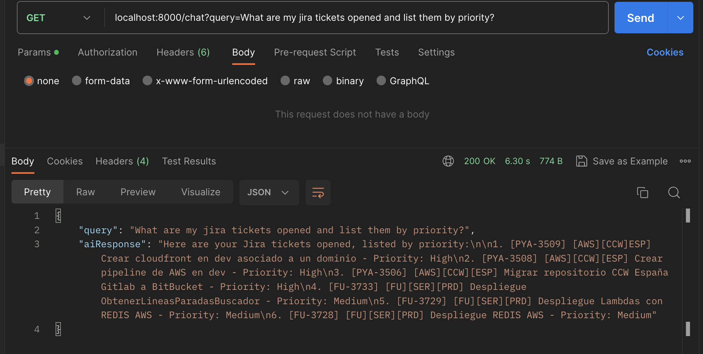

# jira-openai-bot

![Next][chatGpt]![Next][python]

This repository demonstrates how to integrate OpenAI's language model with LangChain to interact with Jira. The integration allows for automated ticket creation, updates, and retrieval using natural language processing capabilities.






## Post from medium
https://medium.com/@KevsAlex/integrating-openai-with-private-apis-44ca1c7f088f

## Prerequisites

Python 3.9+
Jira Account: Ensure you have access to a Jira account and relevant API keys.
OpenAI API Key: Required for accessing OpenAI’s language model.
LangChain Library: Install via pip.


## Running this Project 

For running the server :  

```curl 
   poetry run python app/server.py
```

## Example call :
```curl 
   curl --location 'localhost:8000/chat?query=PlaceQueryHere'
```


[chatGpt]: https://img.shields.io/badge/chatGPT-74aa9c?logo=openai&logoColor=white
[python]: https://img.shields.io/badge/Python-3.9-3776AB.svg?style=flat&logo=python&logoColor=white
